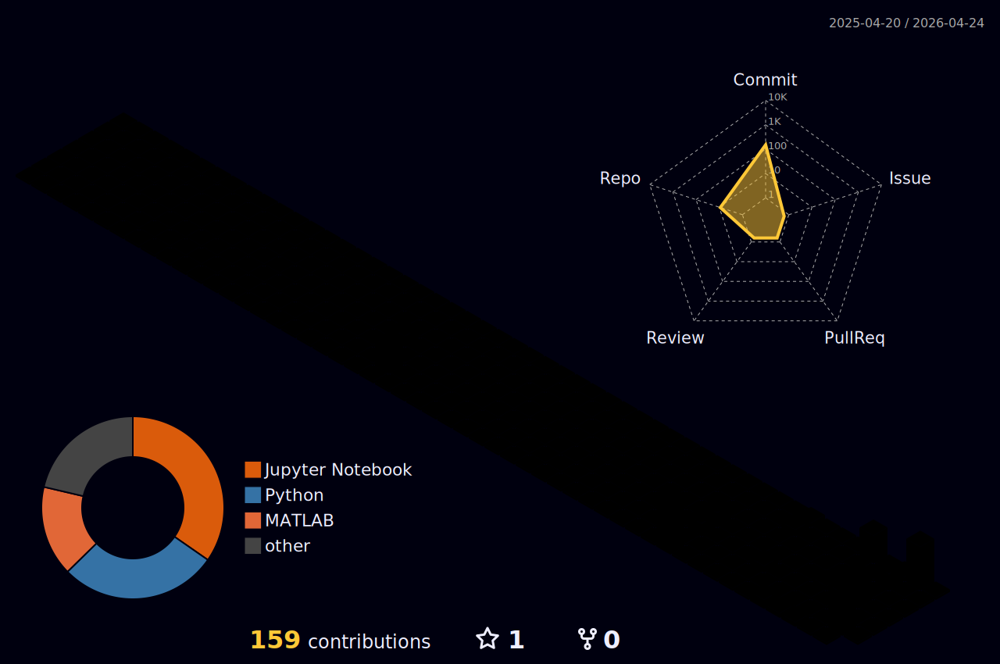

# ⚡ Hello, I'm Abdullah

  

---

### 🚀 About Me
I am a **Computer Science student** at the **Jordan University of Science & Technology (JUST)** with a passion for transforming complex research into production-grade AI applications. My work focuses on the intersection of **Computer Vision**, **MLOps**, and **Arabic NLP**.

- 🔭 Currently developing **TaLibAI**: A RAG-based pipeline utilizing local embeddings and the **Gemma 4** model to process complex technical documentation.
- 🌱 Learning **Unity** for a 2D Action RPG project, exploring the bridge between game mechanics and AI.
- ⚡ **Local Power:** I perform local inference and training on a dedicated **NVIDIA RTX 4050** setup.
- 🌐 Checkout my interactive portfolio: [abdullah-aljafari.me](https://www.abdullah-aljafari.me/)

---

---

### 🧪 The Lab (Featured Research & Projects)

#### 🤖 [TaLibAI](https://github.com/DRAGOX7/TaLibAI)
*A RAG pipeline for the future of student learning.*
- **Key Features:** Local vector embeddings, chunking strategies for C++ and ML PDFs, and optimized query response.
- **Stack:** Python, Gemma 4, PyTorch.

#### 👁️ Deepfake Detection & Ablation Studies
*Pushing the boundaries of model reliability.*
- Conducted rigorous studies on **EfficientNet** architectures, analyzing the impact of feature masking on model "flip-rates" and confidence scores.

#### 🧠 AlexNet Implementation
- Reconstructed the AlexNet architecture to verify its **61.1 million parameters** and validated performance through real-world image inference.

---

### 💻 Tech Stack & Tooling

**Artificial Intelligence**
   

**Web & Development**
  

**MLOps & Workflow**
  

---

### ⚙️ Hardware Environment
*Because some architectures deserve more than just a CPU.*
- **GPU:** NVIDIA GeForce RTX 4050 Laptop GPU
- **Focus:** Local LLM fine-tuning and Computer Vision inference optimization.

---

### 📊 GitHub Insights

---

  
  
  

