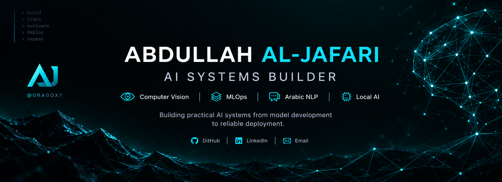

  

  [Portfolio](https://www.abdullah-aljafari.me/) · [LinkedIn](https://linkedin.com/in/abdullah-aljafari-a32100352/) · [Email](mailto:aljafariabdullah2005@gmail.com)

## About

Third-year AI student at Jordan University of Science & Technology (JUST). I build practical AI systems from model development through deployment, with a focus on computer vision, MLOps and Arabic NLP. I prefer local-first AI: no API dependency, full control of the pipeline.

## Featured Projects

**[TaLibAI](https://github.com/DRAGOX7/TaLibAI)** — Bilingual Arabic-English RAG for technical documentation
Custom chunking for code-heavy PDFs, local embeddings for privacy, and optimized retrieval latency on consumer hardware.
`Python · Gemma · PyTorch · Local Embeddings`

**[chest-xray-mlops](https://github.com/DRAGOX7/chest-xray-mlops)** — Chest X-ray abnormality detection, deployed end to end
DenseNet121 served via FastAPI, containerized with Docker and auto-deployed to Azure through GitHub Actions.
`PyTorch · FastAPI · Docker · Azure · CI/CD`

**Deepfake Detection Ablation Study** — What EfficientNet actually relies on
Feature-masking experiments measuring prediction flip-rates and confidence collapse.
`PyTorch · EfficientNet`

**AlexNet from Scratch** — Architecture replication
Rebuilt the 2012 architecture in PyTorch and verified the exact 61,100,840 parameter count.
`PyTorch · NumPy`

## Skills

**AI / ML:** Python, PyTorch, TensorFlow, OpenCV, Hugging Face
**MLOps:** ZenML, Docker, Azure, FastAPI, GitHub Actions
**Web:** Next.js, React, Tailwind CSS
**Tools:** Git, Linux, CUDA

## GitHub Statistics

  

  

## Contact

Open to internships and collaborations. Reach me at [aljafariabdullah2005@gmail.com](mailto:aljafariabdullah2005@gmail.com) or on [LinkedIn](https://linkedin.com/in/abdullah-aljafari-a32100352/).
