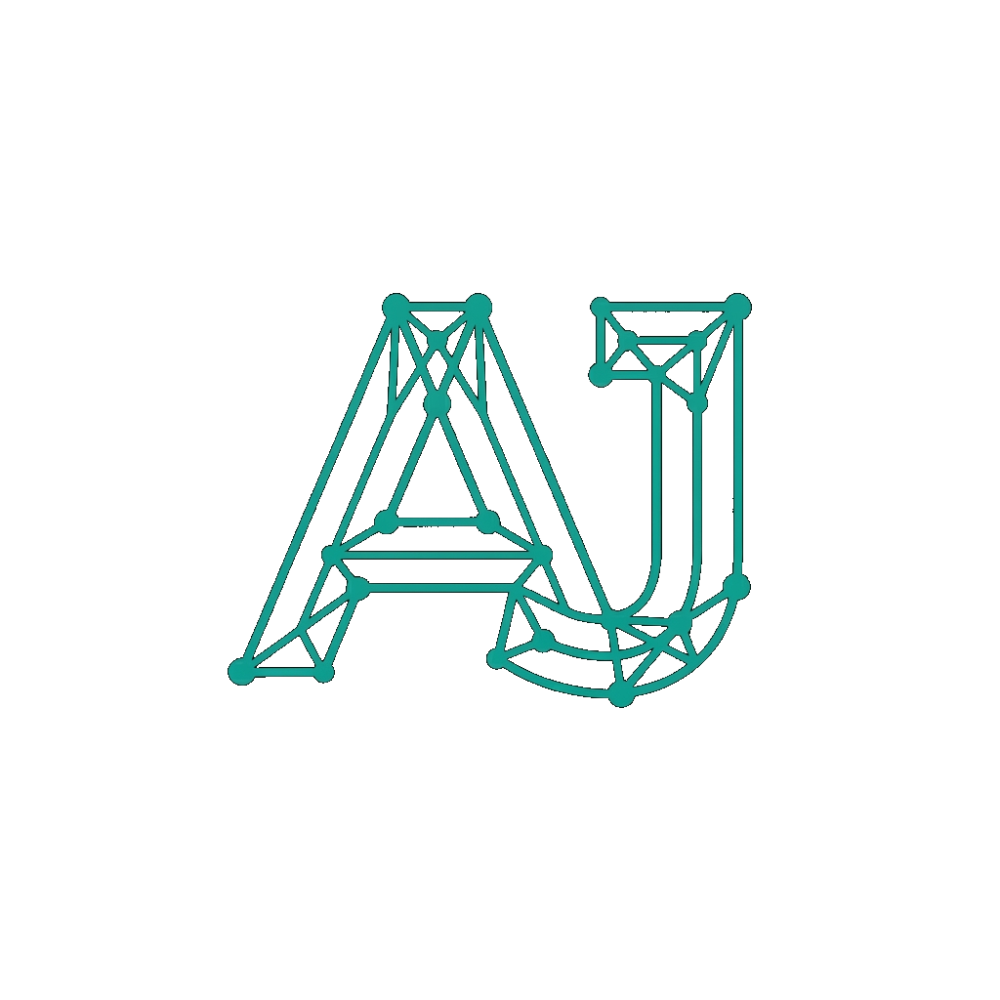

  

  
   
  
   
  
  
  
  

## About

Fourth-year AI student at Jordan University of Science & Technology (JUST). I build practical AI systems from model development through deployment, with a focus on computer vision, MLOps and Arabic NLP. I prefer local-first AI: no API dependency, full control of the pipeline.

## Featured Projects

<table>
  <tr>
    <td width="50%" valign="top">
      <h3><a href="https://github.com/DRAGOX7/TaLibAI">TaLibAI</a></h3>
      <b>Bilingual Arabic-English RAG for technical docs</b> 
      Custom chunking for code-heavy PDFs, local embeddings for privacy, and optimized retrieval latency on consumer hardware.  
      <code>Python</code> <code>Gemma</code> <code>PyTorch</code> <code>Local Embeddings</code>
    </td>
    <td width="50%" valign="top">
      <h3><a href="https://github.com/DRAGOX7/chest-xray-mlops">chest-xray-mlops</a></h3>
      <b>Chest X-ray detection, deployed end to end</b> 
      DenseNet121 served via FastAPI, containerized with Docker and auto-deployed to Azure through GitHub Actions.  
      <code>PyTorch</code> <code>FastAPI</code> <code>Docker</code> <code>Azure</code> <code>CI/CD</code> 
      
    </td>
  </tr>
  <tr>
    <td width="50%" valign="top">
      <h3>Deepfake Detection Ablation Study</h3>
      <b>What EfficientNet actually relies on</b> 
      Feature-masking experiments measuring prediction flip-rates and confidence collapse.  
      <code>PyTorch</code> <code>EfficientNet</code>
    </td>
    <td width="50%" valign="top">
      <h3>AlexNet from Scratch</h3>
      <b>Architecture replication</b> 
      Rebuilt the 2012 architecture in PyTorch and verified the exact 61,100,840 parameter count.  
      <code>PyTorch</code> <code>NumPy</code>
    </td>
  </tr>
</table>

## Skills

**`// AI & Deep Learning`**

**`// MLOps & Infrastructure`**

**`// Full-Stack Web`**

**`// Tooling`**

## GitHub Statistics

  

  

## Contact

Open to internships and collaborations.

